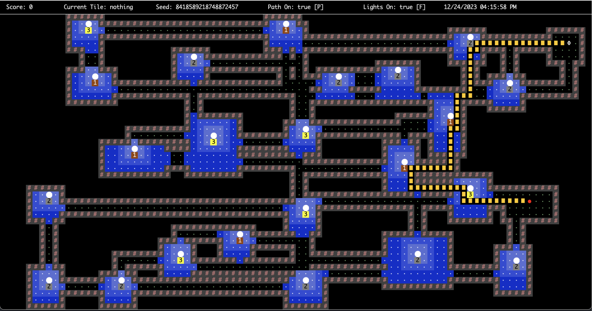

# Coin Collector
## A web application that opens a game in a GUI.

Uses Spring Boot framework for back-end and MySQL for storing game state data.

This project required good planning of algorithms, data structures, and designing all the classes and interactions

### Relevant Directories
<ul>
  <li><a href="https://github.com/octaviolomeli/Coin-Collector/tree/main/src/test/java/com/octaviolomeli/coinCollector/core">Tests</a></li>
  <li><a href="https://github.com/octaviolomeli/Coin-Collector/tree/main/src/main/resources/static">Frontend</a></li>
  <li><a href="https://github.com/octaviolomeli/Coin-Collector/tree/main/src/main/java/com/octaviolomeli/coinCollector/core">Backend</a></li>
</ul>

In-game photo:

